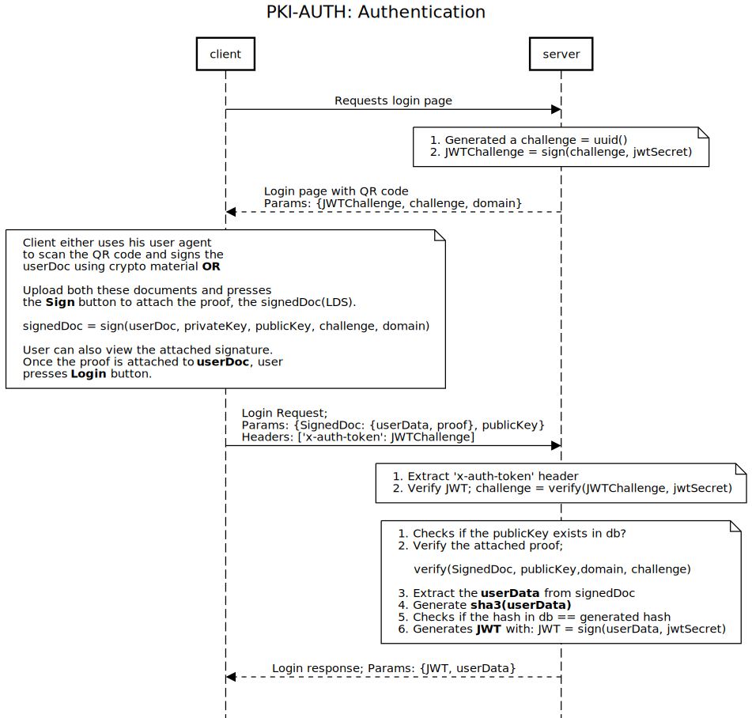
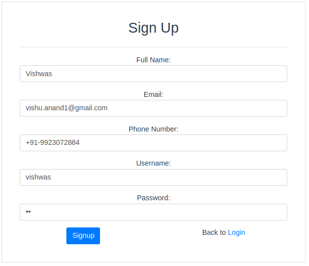
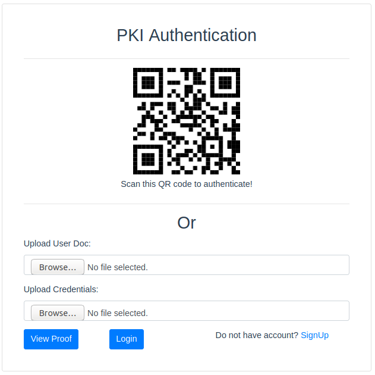
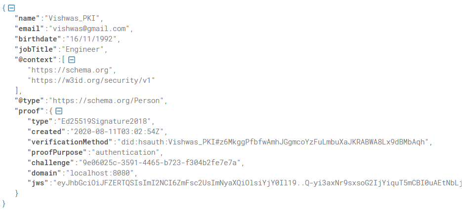

## Problem with SSO kind of system

[Ref:](https://jolocom.io/wp-content/uploads/2018/10/Self-sovereign-Identity-_-Blockchain-Bundesverband-2018.pdf)

Although the user arguably gained in security  and usability,  it ceded control to large centralized  corporations  with  a  :
- complete  view  of  the digital  footprint  of  their  users
- compromising  privacy  and  
- leading  to  unforeseeable  uses  of  our  data  in  violation  of fundamental principles of **data protection**.
- vendor  lock-in: It further created centralization around these IDPs  or  SSO  providers,  leading  to  an  over-reliance  on  very  few  services  and  large honey pots of data that they control.
- single points of failure

This created a pain point with regard to business issues, liability, privacy and security.

Also, these business-driven identity providers can deny users access to their services (and those that they mediate or gate keep) at any time.

> Until now, with great levels of efficiency came great levels of centralized control too. Therefore,the universal layer for identity has to decentralize control, by empowering myriad self-sovereign individuals and entities to have full control over how they utilize their data and manage their identity. 

> Ownership  of  systems  that  underpin  the  digital  privacy  of  the  future  must  not  be controlled or owned by any single entity.

Central  storage  and  management  of  identities  and  related  data  of  millions  of  users creates a huge incentive for hackers to break into these data silos and steal millions of identities with just one hack.

Recent events put a focus on identity theft and the impact it can have on the individual, on political processes and the society overall.

### Four cases show on a massive scale the possible consequences of identity theft:

- Equifax Data BreachEquifax  is  a  US  based  consumer  credit  reporting  agency.  It  announced  in September 2017 that a massive data breach had disclosed data of millions of users  between  the  months  of  May  and  July  2017.  Due  to  this  data  breach, sensitive  personal  information  such  as  first  and  last  name,  Social  Security numbers, birth dates, addresses, credit card data, etc. of approximately 147.9million US Americans were exposed

- The Facebook Cambridge Analytica ScandalAn app called “This is Your Digital Life” by Cambridge Analytica, which purpose it was to ask several hundred thousand of Facebook users to complete a survey only  for academic use,  was allowed by Facebook ́s design to not only collect data of the users who agreed to participate in the survey, but also to collect that data  from  people  in  those  users ́  social  network.  Because  of  this,  data  of approximately 87 million users was collected. The data included public profile, page likes, birthdate and current city.  Based   on   this   data   Cambridge   Analytica   was   able   to   create   and   sell psychographic profiles for the subjects of the data.

- The Facebook “View As” HackIn September of 2018 more than 50 million Facebook accounts were breached as the result of an anonymous hacker attempting to exploit the Facebook “view as” feature, which lets people see what their own profile looks like to someone else.  This allowed the hackers to steal OAuth bearer access tokens, which are the equivalent of digital keys that control access to the account. The event was made significantly worse by the fact that it enabled hackers to access not just the breached accounts but any other accounts that those users logged into via their Facebook credentials, demonstrating  the  big risks behind social  login or SSO per the federated model of identity.  

- Estonian ID HackSince  2002  the  national  ID  card  of  Estonia  isa  mandatory  identification document for Estonians and it is one of the cornerstones of the Estonian e-state. The Estonian  ID card enables digital  identification,  i.e. accessing  web portals and e-services, bank transactions and digitally signing documents.Additionally, it can be used for electronic voting. In August 2017 a potential security threat was  discovered  that  affected  750.000  ID  cards  issued  between  16th  October 2014 and 26th October 2017. This security threat could have led to the identity theft of users holding an ID card issued during the respective time frame. It was caused  by  a  software  library  used  by  the  smartcard  that  allowed  to  compute private keys from public ones and therefore enabling attackers to steal and use the identity of users holding such an  ID card.  According to the  ISA (Estonian Information System Authority) no identity theft on the base of this security issue has occurred

## What such system can solve?

- privacy protection: it has a strong visionary alignment with the EU’s General Data Protection Regulation (GDPR). 
- data protection 
- It  introduces  _data  management  principles_  to  move  the  world towards an interoperable ecosystem of connected entities. 

## Use cases

Ref: https://jolocom.io/wp-content/uploads/2018/10/Self-sovereign-Identity-_-Blockchain-Bundesverband-2018.pdf

**Register for an online course and other e-learning**

The identity holder will be able to register for different e-learning services in a secure way via that the utilization of Verifiable Credentials about her qualification to join the course. Services will be able to grade the performance and issue it as a Verifiable Credential to the identity holder. Thisgrade can then again be used to get 
access to further education

**Provide verified student ID across domains**

A  SSI  solution  may  help  to  get  students  benefits  by  utilizing  verified  credentials about enrollment, and other needed certificates. Depending on the university there are  currently  possibilities  for  faking  the  ID  or  the  ID  can  be  outdated  and  still  be used. With SSI, student benefits can be fairly attributed with lower risk of faking and clear  information  about  the  validity  of  a  credential,  especiallywith  regard  to expiration dates.

# PKI-Auth

A Password less authentication protocol built using PKI and Linked Data Signature to securely authenticate users into websites and protect their data. The protocol accomplishes the following two goals:

> How passworldless solution can be implemented using Public Key Infrastructue and become better alternative of password based authentications. 

> How PKI based solution can protect the User's data by not letting the server store the user's personal information but still be able to use the application the way it was being used earlier. 

The protocol uses Linked Data Signature and JSON Web Token as its core concepts along with JSON-ld as message format. 

## Related Work

FIDO is trying to solve the very same problem. But FIDO is complex to understand and implement for a normal devleoper. More over it involved costs of certification and all. Here, our goal is to come up with a very light weight sdk so that developers can implement PKI efficiently and securely. 

- https://github.com/WebOfTrustInfo/rwot4-paris/blob/master/topics-and-advance-readings/did-auth.md#related-work

## Protocol

### Core concepts

// TODO: Write explanations.

* JSON-ld
* Linked Data Signatures
* JWT

### Registration

- [Source](https://sequencediagram.org/index.html#initialData=C4S2BsFMAIAUGkCSBaAggVQCoAkBc0AlSAcxAGdgAnAQ1AHsA7AKCYAdrLQBjEdh4aF3AhI-Nh269q-aGUiUAbvJZCR-ZAD45i+fiIBHAK6QKZaJRLkqtEI2jtikJtqWVoyTatHA9lijXoGaAAzOkoAW2gAbXQAEVRYELDwgF0mBjpgGDpXQWFvXABGADpoADEQcHAzYAALGCJSfxs7UIjoAB0GACZS2LoAdwZwOmoAEzNHBnlaSDHoACkAZQB5ADlkcHmxui4yXC7oI+gAKhP0bX6uYoArMkYz6Gl5s4BhSgBPVmA6W-uGM5dADMpSWPwsNXqcmgOy4hnC3jMIAYh2Ohm0yGoUwEYWgIy41HAMMgChAXEgXQALKULvJ7BC5JCYGcyCBiAxDKxHgAjQzAH4MUoqfIyTSyeSufBLNkc1jmSBGEzAYpdWAcajhfbQADerEM3OEXHgkA+ABpZLVqECABTo+RXACUAF90plsrkXLpoEsJXSKGETPZ9YbjR8ngwxl0yJabXbKI7oMjoHUYHHk9QDZBis5fW4PBovPwpTLOYQTKxGHJSit4NmmEA)

// TODO: Write explanations for userdoc and credential doc

### Authentication

- [Source](https://sequencediagram.org/index.html#initialData=C4S2BsFMAIAUGkCSBaAggVQCoAkBc1UBXYAC0gDtQBjAQ1AHtyAoJgBxoCdqR3LorwICsDaduvYNADOkDgDdZLAUMrIAfDPmz8AJUgBHQpCnAp0cPQDmIctHaXITcvWAx6CjtNkfcARgB00ADiFLJ0kAAm0DT8JDTgUOQO0AC80ISEIBEAFACUADrkAEyBAFIA6pgAwnEJFMlpUiCW5NlUtYkOADTQAFYA7sAAypBUHJDAuUyaHtDI6vyCwrgAMlY2djTJ-WAk0ACKOvz0EZCFsJw0ALZS+ADeFdUd9ZA97fGdr9AR9Fc0NgBfJwuNyzZTLKpLPiQXaydIyMwkEBmQiaaIOSiFYD0aS0WykGCHY6naLkKJNFpmAmFVGyAAi9Co8Jsln4HAAnqxsdA-q4OCB4tAAFRCgDyOhFhUK6FYFhoUQARi49gSZN9GYQrsIzDQyXZxlIEViyMKhUNmuQRdAFcRsficXRgDR2tACfr6PQAGY9N0U8iRBlUbIrOlDXL+KXkP0BxmpaQW7K0jiBnqsflycLwSDs1OEBWCKhZnOxD4vHo-P42ArkaVovHRcBSHFyIT9V0mx3Osjki10QjjCPkUXkKgwN1pj2e6DI6LAJ3tSKunEipOBkU9JOFNPGBGmtbWS1C622xiBJjgvjqGbafcbPSGYzAADc50uN3u5paMao91XdBoqYcJOAK5vmICFtmAKFNgkDyrItzQAA2gA5AAHsgNDECQyDYgA1hQyH4I8NSlkkkAALrAq40DuHC14cH4gQAKKocAHDOpIaEYVhOH0Ph5DIdAZBwRwhQlNAABqsggJ67LQI8T4lnUZFxh4MnstkxHPGRPQDMMozjJMVGgnR3jaAE0A1KMuFmDJ7YwKweYFkW0CQKhyKmNOtgRAqAD8YmBFJ-KyfZs7zt27peopkbQLF0BqbJ2Sfv6EQpnYTngUWXQVv85BvNpDjVoUADMzGsexVCSG6K6aHS-5Wp6QFXPGX6pYyhQACyBCE-rsdRIpSHExWJrV-65JK5AAKyBFZVA2dOU5unEg1ed8CqpGkGJhK4UTLSQhQAGzdaEfXGKajxWjspBEZUcZ+iN9L-rpgwjGMExTPRczqBewD4LetgGqwjAyIpFzse+0APJUG6jU6QIsEwQA)

### Authorization

- [Source](https://sequencediagram.org/index.html#initialData=C4S2BsFMAIAUGkCSBaAggVQCoAkBc1UBXYACwHsAnEALwENQyA7AKGYAdaLQBjEDx4NG7gQkAe048+tAdADOkCgDdFrRmWAwyKikJFjg+AML7ZAc0jA50AFIB1TNCbcY4MmYsATRC2GiByAB8CsqKuABKkACOhJBygmwUGpDcmp6RcmSEFC4AOozYkLSeinL4ANoA5AAeyLTEJMjAZADWYpX49pgAuszqmk468oo6uACMAHTQAKLVwBS0qdA1dQ1Nre3QJEUlFPkATFMAaoogAGYAnrYOANzQOucXABRdADTQAFYA7sAAyikUSwASmYISGyCCfgM+FQ4DcX2sixccjkrCAA)

### Evaluation Metrics

* Trust
* Data Protection
* Usability
* Security

## Demo 

Follow the [instructions](#installation--usage) to run the `client` and `server` applications. First setup and run the server then run the client. Once it runs successfully, the client app can be accessed on `http://localhost:8080/` url. The tool supports two types of authentications; BASIC-AUTH (username/password based) and PKI-AUTH (passwordless).

### Basic Authentication

#### Registration & Login

Registration | Login
------------ | ------
 | 

Register a use by filling the registration form and then go to login page to login into the website. On successfull login, the user is taken into `home` page which show user profile. 

#### Inside Database

Let us take a look into database when registered by this mechanism. 

As you can clearly see user personal information sitting in the database. 

### PKI Authentication

Now, go back to the login page [http://localhost:8080/login] but this time lets use `PKI-Auth`. But before that, lets register a user. 

#### Registration

To register a user go to register page [http://localhost:8080/register_pki] and fill the form.

##### User Doc & Crypto Material [JSON-ld]

Once the form is filled, you can download crypto materials (`credential.json`) and user doc (`userDoc.json`). Note that you are not yet signedup. 

User doc | Credential doc
---------|---------------
 | 

To signup, press on **SignUp** button. If you are redirected back to login page, meaning, you are signedup. Let's take a look at the db again.

#### Inside Database

As you can see in the db (the second row), none of user personal information went into it. Only the `publickey` and `hash` of userData resides - Quite safe huh!

#### Login

To login using `PKI-auth`, you either need a wallet to scan the QR code or, just provide crypto material doc and userDoc. You can click on **View Proof** button to see (optional) what signature got added to the userDoc. Finally click on **Login** button to go to user profile page.

Login | Proof
------|-------
 | 

## Attack Vectors

// TODO

## Problems with Basic-Auth

* Store user sensitive information in the server database which can be prone to hack.
* Passwords on their own do not constitute sufficient security for many activities.
* Passwords can be shared. 
* MFA brings the complexity and does not really solve the sharing problem. 
* Passwords needs to be changed frequently.
* Increase in password complexity can bring user hinderance. 

> My father sent me facebook request for the 7th time the previous month. ha ha! 

> Is security is not for all kind of user?

## Problems with PKI-Auth

* For website
    * Every website would need their user to register with them, as well as they need to provide some user-agent for storing credentials and user doc to their user. 
    * As compared to basic-auth, the pki-auth is still complex for a website to implement and it has security concerns. So the developer must have to be aware of attack vectors and proper cryptographic premitives.
* For user
    * On the other hand, user has to install multiple user-agents to manage the same userdata but different crypto-materials for different website. It is good for the security since every website will have different keypairs but very bad design for usability. 
* Overall, usability is the main challenge to solve here. 

## Next Step

* Now that we undestood the problem with the protocol, we need to come up with a solution where user register only for one time (like in case of social login) and other website just need to support that login. In this way, user will only have one wallet and one time registration.
* However, we have to make sure that user uses different credentials for different websites (unlike facebook where one credetials is being used everywhere)

## Installation & Usage

* [Client](client/README.md)
* [Server](server/README.md)

## Disclaimer and Issues

* This work is **NOT** ready for production yet. So please use this work only for understanding purpose. 
* Any other suggestion related to attack vectors or any other bugs in code, please create a issue for that. Thank You!

