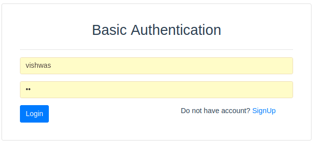
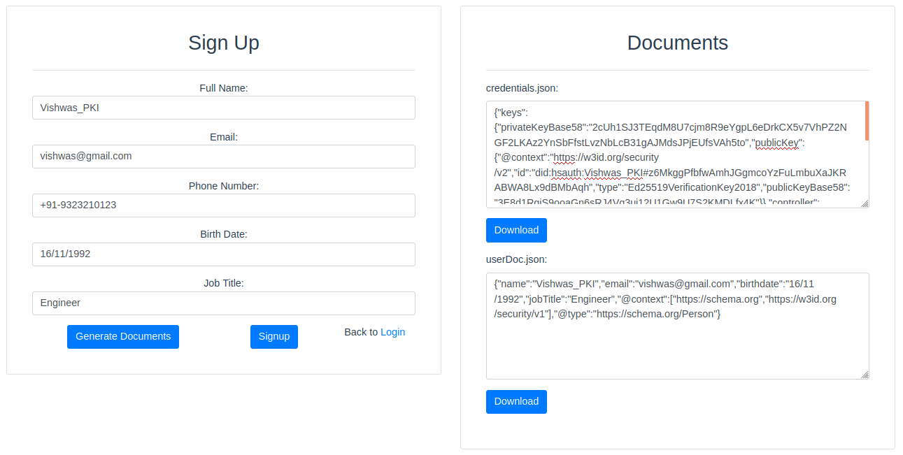
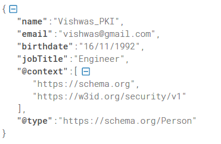
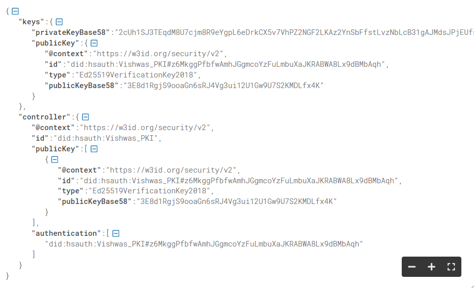

# Authentication Playground

The tool supports two types of authentications; BASIC-AUTH (username/password based) and PKI-AUTH (passwordless). The goal of this experiment is to compare between these two type of authentication mechanisms and to prove the following:

> How passworldless solution can be implemented using Public Key Infrastructue and become better alternative of password based authentications. 

> How PKI based solution can protect the User's data by not letting the server store the user's personal information but still be able to use the application as they were using earlier. 

For authorization it is uses [`JWT - Json web Token`](docs/jwt-concept.md) in both the cases.

## Basic Authentication

### Registration


### Inside Database


### Login



## PKI Authentication

### Registration




#### User JSON-ld Doc




#### Crypto Material



### Inside Database


### Login


#### Proof


## Installation & Usage

### Client

```js
cd client
npm i
npm run serve
```

### Server

```js
cd server
npm i
npm run newdb // to setup database. Do not run this everytime. 
npm run dev
npm run build
npm run test
npm run start 
```

## APIs

- `api/auth/register`: To register a user
- `api/auth/login`: Tp authenticate a user
- `api/auth/verify`: Verifies the authToken passed in header for client
- `api/blog/created`: Protected with JSON web token
- `api/blog/challenge`: To get a new challenge
