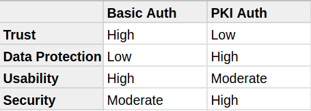

# PKI-Auth

A Password less authentication protocol built using PKI and Linked Data Signature to securely authenticate users into websites and protect their data. The protocol accomplishes the following two goals:

> How passworldless solution can be implemented using Public Key Infrastructue and become better alternative of password based authentications. 

> How PKI based solution can protect the User's data by not letting the server store the user's personal information but still be able to use the application the way it was being used earlier. 

The protocol uses Linked Data Signature and JSON Web Token as its core concepts along with JSON-ld as message format. 

## Related Work

FIDO is trying to solve the very same problem. But FIDO is complex to understand and implement for a normal devleoper. More over it involved costs of certification and all. Here, our goal is to come up with a very light weight sdk so that developers can implement PKI efficiently and securely. 

## Protocol

### Registration

- [Source](https://sequencediagram.org/index.html#initialData=C4S2BsFMAIAUGkCSBaAggVQCoAkBc0AlSAcxAGdgAnAQ1AHsA7AKCYAdrLQBjEdh4aF3AhI-Nh269q-aGUiUAbvJZCR-ZAD45i+fiIBHAK6QKZaJRLkqtEI2jtikJtqWVoyTatHA9lijXoGaAAzOkoAW2gAbXQAEVRYELDwgF0mBjpgGDpXQWFvXABGADpoADEQcHAzYAALGCJSfxs7UIjoAB0GACZS2LoAdwZwOmoAEzNHBnlaSDHoACkAZQB5ADlkcHmxui4yXC7oI+gAKhP0bX6uYoArMkYz6Gl5s4BhSgBPVmA6W-uGM5dADMpSWPwsNXqcmgOy4hnC3jMIAYh2Ohm0yGoUwEYWgIy41HAMMgChAXEgXQALKULvJ7BC5JCYGcyCBiAxDKxHgAjQzAH4MUoqfIyTSyeSufBLNkc1jmSBGEzAYpdWAcajhfbQADerEM3OEXHgkA+ABpZLVqECABTo+RXACUAF90plsrkXLpoEsJXSKGETPZ9YbjR8ngwxl0yJabXbKI7oMjoHUYHHk9QDZBis5fW4PBovPwpTLOYQTKxGHJSit4NmmEA)

### Authentication

- [Source](https://sequencediagram.org/index.html#initialData=C4S2BsFMAIAUGkCSBaAggVQCoAkBc1UBXYAC0gDtQBjAQ1AHtyAoJgBxoCdqR3LorwICsDaduvYNADOkDgDdZLAUMrIAfDPmz8AJUgBHQpCnAp0cPQDmIctHaXITcvWAx6CjtNkfcARgB00ADiFLJ0kAAm0DT8JDTgUOQO0AC80ISEIBEAFACUADrkAEyBAFIA6pgAwnEJFMlpUiCW5NlUtYkOADTQAFYA7sAAypBUHJDAuUyaHtDI6vyCwrgAMlY2djTJ-WAk0ACKOvz0EZCFsJw0ALZS+ADeFdUd9ZA97fGdr9AR9Fc0NgBfJwuNyzZTLKpLPiQXaydIyMwkEBmQiaaIOSiFYD0aS0WykGCHY6naLkKJNFpmAmFVGyAAi9Co8Jsln4HAAnqxsdA-q4OCB4tAAFRCgDyOhFhUK6FYFhoUQARi49gSZN9GYQrsIzDQyXZxlIEViyMKhUNmuQRdAFcRsficXRgDR2tACfr6PQAGY9N0U8iRBlUbIrOlDXL+KXkP0BxmpaQW7K0jiBnqsflycLwSDs1OEBWCKhZnOxD4vHo-P42ArkaVovHRcBSHFyIT9V0mx3Osjki10QjjCPkUXkKgwN1pj2e6DI6LAJ3tSKunEipOBkU9JOFNPGBGmtbWS1C622xiBJjgvjqGbafcbPSGYzAADc50uN3u5paMao91XdBoqYcJOAK5vmICFtmAKFNgkDyrItzQAA2gA5AAHsgNDECQyDYgA1hQyH4I8NSlkkkAALrAq40DuHC14cH4gQAKKocAHDOpIaEYVhOH0Ph5DIdAZBwRwhQlNAABqsggJ67LQI8T4lnUZFxh4MnstkxHPGRPQDMMozjJMVGgnR3jaAE0A1KMuFmDJ7YwKweYFkW0CQKhyKmNOtgRAqAD8YmBFJ-KyfZs7zt27peopkbQLF0BqbJ2Sfv6EQpnYTngUWXQVv85BvNpDjVoUADMzGsexVCSG6K6aHS-5Wp6QFXPGX6pYyhQACyBCE-rsdRIpSHExWJrV-65JK5AAKyBFZVA2dOU5unEg1ed8CqpGkGJhK4UTLSQhQAGzdaEfXGKajxWjspBEZUcZ+iN9L-rpgwjGMExTPRczqBewD4LetgGqwjAyIpFzse+0APJUG6jU6QIsEwQA)

### Authorization

- [Source](https://sequencediagram.org/index.html#initialData=C4S2BsFMAIAUGkCSBaAggVQCoAkBc1UBXYACwHsAnEALwENQyA7AKGYAdaLQBjEDx4NG7gQkAe048+tAdADOkCgDdFrRmWAwyKikJFjg+AML7ZAc0jA50AFIB1TNCbcY4MmYsATRC2GiByAB8CsqKuABKkACOhJBygmwUGpDcmp6RcmSEFC4AOozYkLSeinL4ANoA5AAeyLTEJMjAZADWYpX49pgAuszqmk468oo6uACMAHTQAKLVwBS0qdA1dQ1Nre3QJEUlFPkATFMAaoogAGYAnrYOANzQOucXABRdADTQAFYA7sAAyikUSwASmYISGyCCfgM+FQ4DcX2sixccjkrCAA)

### Evaluation Metrics

* Trust
* Data Protection
* Usability
* Security

## Demo 

Follow the [instructions](#installation--usage) to run the `client` and `server` applications. First setup and run the server then run the client. Once it runs successfully, the client app can be accessed on `http://localhost:8080/` url. The tool supports two types of authentications; BASIC-AUTH (username/password based) and PKI-AUTH (passwordless).

### Basic Authentication

#### Registration & Login

Registration | Login
------------ | ------
 | 

Register a use by filling the registration form and then go to login page to login into the website. On successfull login, the user is taken into `home` page which show user profile. 

#### Inside Database

Let us take a look into database when registered by this mechanism. 

As you can clearly see user personal information sitting in the database. 

### PKI Authentication

Now, go back to the login page [http://localhost:8080/login] but this time lets use `PKI-Auth`. But before that, lets register a user. 

#### Registration

To register a user go to register page [http://localhost:8080/register_pki] and fill the form.

##### User Doc & Crypto Material [JSON-ld]

Once the form is filled, you can download crypto materials (`credential.json`) and user doc (`userDoc.json`). Note that you are not yet signedup. 

User doc | Credential doc
---------|---------------
 | 

To signup, press on **SignUp** button. If you are redirected back to login page, meaning, you are signedup. Let's take a look at the db again.

#### Inside Database

As you can see in the db (the second row), none of user personal information went into it. Only the `publickey` and `hash` of userData resides - Quite safe huh!

#### Login

To login using `PKI-auth`, you either need a wallet to scan the QR code or, just provide crypto material doc and userDoc. You can click on **View Proof** button to see (optional) what signature got added to the userDoc. Finally click on **Login** button to go to user profile page.

Login | Proof
------|-------
 | 

## Attack Vectors

// TODO

## Problems with Basic-Auth

* Store user sensitive information in the server database which can be prone to hack.
* Passwords on their own do not constitute sufficient security for many activities.
* Passwords can be shared. 
* MFA brings the complexity and does not really solve the sharing problem. 
* Passwords needs to be changed frequently.
* Increase in password complexity can bring user hinderance. 

> My father sent me facebook request for the 7th time the previous month. ha ha! 

> Is security is not for all kind of user?

## Problems with PKI-Auth

* For website
    * Every website would need their user to register with them, as well as they need to provide some user-agent for storing credentials and user doc to their user. 
    * As compared to basic-auth, the pki-auth is still complex for a website to implement and it has security concerns. So the developer must have to be aware of attack vectors and proper cryptographic premitives.
* For user
    * On the other hand, user has to install multiple user-agents to manage the same userdata but different crypto-materials for different website. It is good for the security since every website will have different keypairs but very bad design for usability. 
* Overall, usability is the main challenge to solve here. 

## Next Step

* Now that we undestood the problem with the protocol, we need to come up with a solution where user register only for one time (like in case of social login) and other website just need to support that login. In this way, user will only have one wallet and one time login.
* However, we have to make sure that user uses different credentials for different websites (unlike facebook where one credetials is being used everywhere)

## Installation & Usage

* [Client](client/README.md)
* [Server](server/README.md)

## Disclaimer and Issues

* This work is **NOT** ready for production yet. So please use this work only for understanding purpose. 
* Any other suggestion related to attack vectors or any other bugs in code, please create a issue for that. Thank You!

